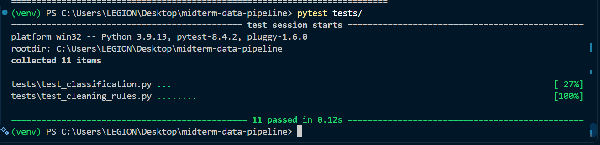
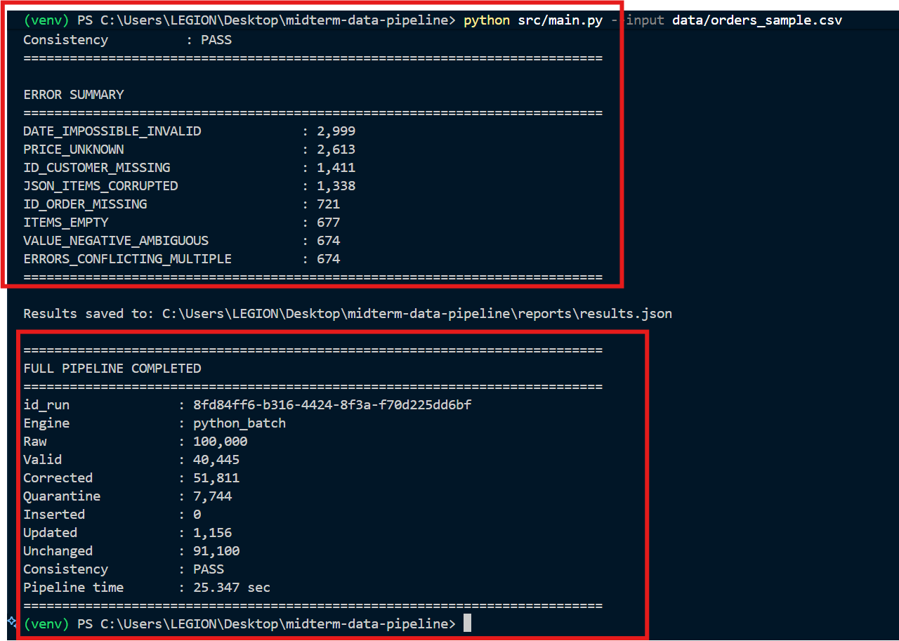
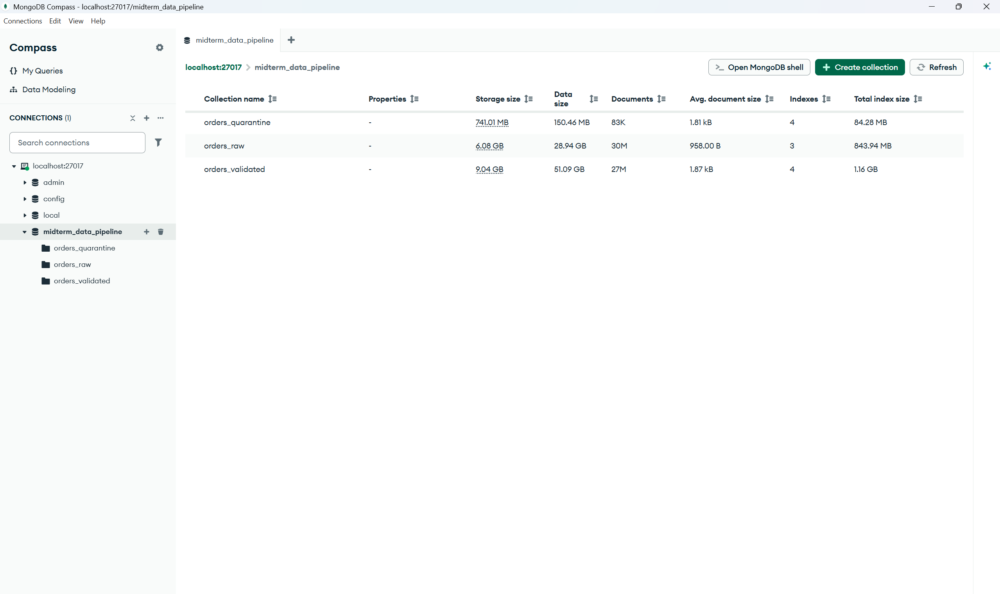
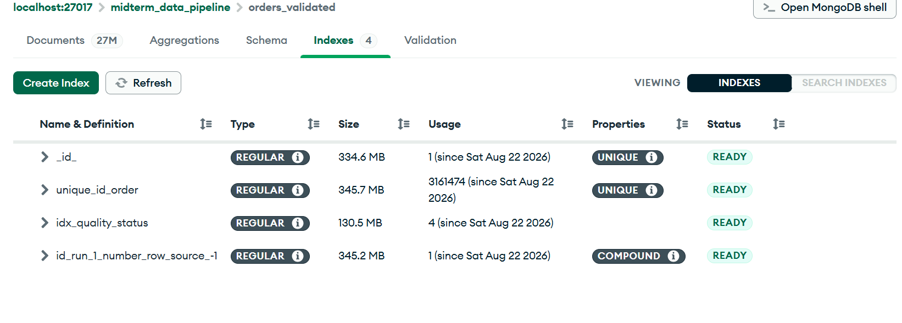
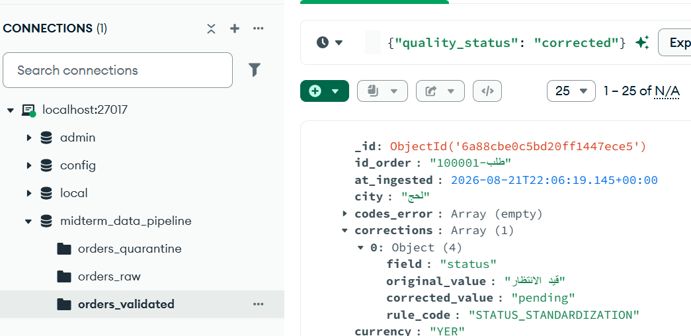
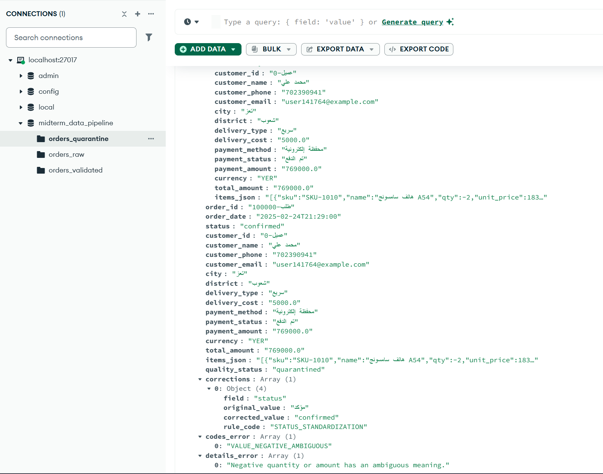
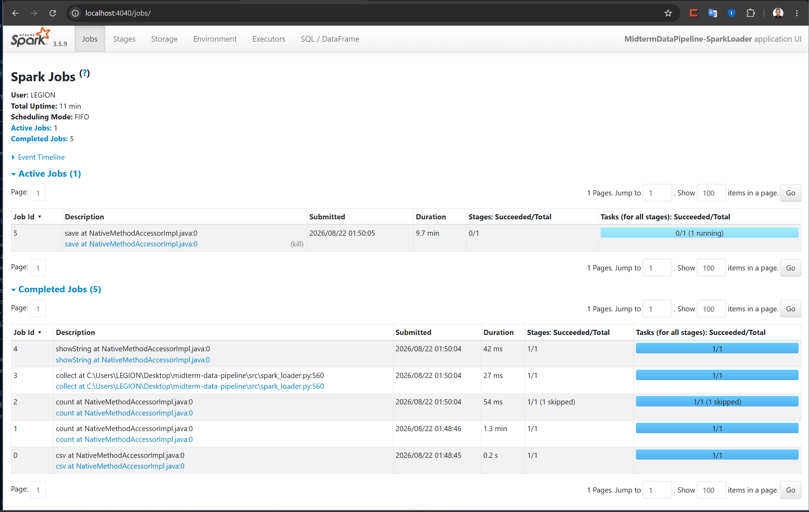

<div align="center">

# ⚡ Hybrid Big Data Pipeline for E-Commerce Orders

### Enterprise-Style ELT Architecture with Dynamic Engine Routing, Automated Data Quality, Audit Trails & Idempotent Upserts

<p>
  
  
  
  
  
</p>

<p>
  <b>
    A fault-tolerant and scalable Big Data ELT pipeline designed to process
    large-scale e-commerce transaction data using intelligent engine routing,
    automated data quality rules, audit trails, quarantine handling,
    and idempotent database upserts.
  </b>
</p>

</div>

---

## 📑 Table of Contents

* [🎯 Project Overview](#-project-overview)
* [✨ Key Features](#-key-features)
* [🏗️ Architecture Overview](#️-architecture-overview)
* [🔄 Data Processing Flow](#-data-processing-flow)
* [🧹 Data Quality & Validation](#-data-quality--validation)
* [🔁 Idempotency & Audit Trail](#-idempotency--audit-trail)
* [📊 Engine Benchmarking](#-engine-benchmarking)
* [📂 Project Structure](#-project-structure)
* [🛠️ Technology Stack](#️-technology-stack)
* [🚀 Installation & Setup](#-installation--setup)
* [▶️ Execution](#️-execution)
* [🧪 Automated Testing](#-automated-testing)
* [📈 Verification & Results](#-verification--results)
* [📸 Visual Proofs](#-visual-proofs)
* [📚 Documentation](#-documentation)
* [🎓 Project Context](#-project-context)

---

# 🎯 Project Overview

This project implements a **Hybrid Big Data ELT Pipeline** for processing large-scale e-commerce order data containing real-world data quality issues.

The pipeline is designed around an **ELT architecture**, where raw records are ingested first without destructive filtering. Data quality processing, normalization, validation, classification, and business-rule enforcement are performed after ingestion.

A **dynamic routing layer** automatically selects the appropriate processing engine according to the input dataset size:

```text
Small Dataset
     │
     ▼
Python Streaming Batch Engine
     │
     │
     └──────────────┐
                    │
                    ▼
               RAW Layer
                    │
                    ▼
          Data Quality Engine
                    │
             ┌──────┴──────┐
             ▼             ▼
          Validated     Quarantine
             │
             ▼
          MongoDB
```

For large datasets:

```text
Large Dataset
     │
     ▼
PySpark Distributed Engine
     │
     ▼
RAW Layer
     │
     ▼
Data Quality & Classification
     │
     ├───────────────┐
     ▼               ▼
Validated        Quarantine
     │
     ▼
MongoDB
```

The system was designed to demonstrate practical Big Data engineering concepts including:

* ELT architecture
* Hybrid processing
* Dynamic engine selection
* Distributed processing
* Data quality engineering
* Data validation
* Error classification
* Auditability
* Data quarantine
* Idempotent writes
* Incremental processing
* Database indexing
* Automated testing
* Pipeline observability

---

# ✨ Key Features

### 🔀 1. Dynamic Processing Engine Routing

The pipeline automatically selects the processing engine based on the input file size.

| Dataset Size | Processing Engine              |
| ------------ | ------------------------------ |
| `<= 200 MB`  | Python Streaming Batch         |
| `> 200 MB`   | PySpark Distributed Processing |

This allows the pipeline to avoid unnecessary distributed-processing overhead for smaller datasets while maintaining scalability for large workloads.

---

### 🛡️ 2. True ELT Architecture

Raw records are ingested into:

```text
orders_raw
```

without destructive pre-filtering.

The original record is preserved before data quality transformations are applied.

This provides:

* Data traceability
* Reproducibility
* Debugging capability
* Original-value preservation
* Auditability

---

### 🧹 3. Automated Data Quality Rules

The pipeline applies multiple automated data-quality transformations, including:

* Arabic digit normalization
* Currency normalization
* Thousand-separator handling
* Date normalization
* Phone-number cleaning
* Email validation
* JSON correction
* Status normalization
* Total-price reconciliation
* Missing-value handling
* Structural validation

Each transformation is associated with a rule identifier so that the modification can be traced.

---

### 🔍 4. Full Audit Trail

Corrected records preserve information about the applied transformations.

Example:

```json
{
  "field": "total_price",
  "original_value": "١,٢٥٠.٥٠",
  "corrected_value": 1250.50,
  "rule": "R_TOTAL_PRICE_NORMALIZATION"
}
```

This enables the system to answer:

> What was changed, why was it changed, and which rule performed the change?

---

### ☣️ 5. Quarantine Layer

Records containing unrecoverable structural or business-rule violations are not silently discarded.

Instead, they are stored separately in:

```text
orders_quarantine
```

Each quarantined record contains structured diagnostics such as:

* Error code
* Error reason
* Original record
* Run ID
* Processing metadata
* Audit information

---

### 🔁 6. Idempotent Upsert

The pipeline uses:

```text
order_id
```

as the primary business key.

A unique MongoDB index prevents duplicate records during repeated or resumed executions.

The pipeline therefore supports safe:

* Re-runs
* Incremental executions
* Recovery after interruption
* Resume operations

---

### 📐 7. Data Consistency Verification

The pipeline verifies the processing results using the fundamental accounting equation:

```text
Raw Count
=
Valid Count
+
Corrected Count
+
Quarantine Count
```

A successful execution must satisfy this consistency condition.

---

# 🏗️ Architecture Overview

```text
                         ┌──────────────────────────────┐
                         │     Dirty E-Commerce Data    │
                         │        CSV / Raw Source      │
                         └──────────────┬───────────────┘
                                        │
                                        ▼
                         ┌──────────────────────────────┐
                         │      File Router / Init      │
                         │                              │
                         │       Size <= 200 MB ?       │
                         └──────────────┬───────────────┘
                                        │
                         ┌──────────────┴──────────────┐
                         │                             │
                    <= 200 MB                       > 200 MB
                         │                             │
                         ▼                             ▼
              ┌─────────────────────┐       ┌─────────────────────┐
              │ Python Batch Engine  │       │  PySpark Engine     │
              │                     │       │                     │
              │ Streaming CSV       │       │ Distributed DataFrame│
              │ DictReader / Yield  │       │ Parallel Processing │
              └──────────┬──────────┘       └──────────┬──────────┘
                         │                             │
                         └──────────────┬──────────────┘
                                        │
                                        ▼
                         ┌──────────────────────────────┐
                         │          RAW LAYER           │
                         │                              │
                         │        orders_raw            │
                         │                              │
                         │ Original Data + Run Metadata │
                         └──────────────┬───────────────┘
                                        │
                                        ▼
                         ┌──────────────────────────────┐
                         │   Data Quality & Validation  │
                         │                              │
                         │  Normalization               │
                         │  Business Rules              │
                         │  Classification              │
                         │  Audit Trail                 │
                         └──────────────┬───────────────┘
                                        │
                          ┌─────────────┴─────────────┐
                          │                           │
                    Recoverable                Unrecoverable
                          │                           │
                          ▼                           ▼
               ┌─────────────────────┐     ┌─────────────────────┐
               │ orders_validated    │     │ orders_quarantine   │
               │                     │     │                     │
               │ Clean / Corrected   │     │ Error Codes         │
               │ Idempotent Upsert   │     │ Failure Reasons     │
               │ Audit Trail         │     │ Original Records    │
               └──────────┬──────────┘     └─────────────────────┘
                          │
                          ▼
               ┌──────────────────────────┐
               │  Reports & Verification  │
               │                          │
               │ results.json             │
               │ results.md               │
               │ Consistency Checks       │
               └──────────────────────────┘
```

---

# 🔄 Data Processing Flow

The complete pipeline follows these stages:

```text
1. Input Dataset
       │
       ▼
2. File Size Detection
       │
       ▼
3. Dynamic Engine Selection
       │
       ├── Python Batch
       │
       └── PySpark
       │
       ▼
4. Raw Ingestion
       │
       ▼
5. Data Normalization
       │
       ▼
6. Quality Rule Execution
       │
       ▼
7. Record Classification
       │
       ├── Valid
       │
       ├── Corrected
       │
       └── Quarantined
       │
       ▼
8. MongoDB Upsert
       │
       ▼
9. Consistency Verification
       │
       ▼
10. Reporting
```

---

# 🧹 Data Quality & Validation

The pipeline implements automated rules to handle common problems found in real-world transactional datasets.

| Category     | Example Problem           | Processing        |
| ------------ | ------------------------- | ----------------- |
| Numeric Data | Arabic-Indic digits       | Normalize         |
| Currency     | Mixed currency formats    | Normalize         |
| Price        | Thousand separators       | Clean & parse     |
| Dates        | Multiple date formats     | Standardize       |
| Phone        | Messy phone numbers       | Normalize         |
| Email        | Invalid formatting        | Validate          |
| JSON         | Corrupted JSON strings    | Repair / Validate |
| Status       | Different status synonyms | Standardize       |
| Totals       | Incorrect total price     | Reconcile         |
| Structure    | Missing required fields   | Quarantine        |

Each record is classified into one of the following categories:

```text
VALID
  │
  └── Record requires no correction.

CORRECTED
  │
  └── Record contains recoverable data-quality issues
      that were automatically fixed.

QUARANTINED
  │
  └── Record contains an unrecoverable structural
      or business-rule violation.
```

---

# 🔁 Idempotency & Audit Trail

## Idempotent Writes

The pipeline uses a unique business key:

```text
order_id
```

MongoDB indexing ensures that the same order can safely be processed multiple times without creating duplicate records.

Conceptually:

```text
Input Record
     │
     ▼
order_id
     │
     ▼
Unique Index
     │
 ┌───┴────┐
 │        │
New      Exists
 │        │
 ▼        ▼
Insert   Upsert
```

---

## Audit Trail

Every automatic correction can retain:

```text
Original Value
      │
      ▼
Transformation Rule
      │
      ▼
Corrected Value
      │
      ▼
Audit Record
```

This makes the pipeline suitable for environments where data lineage and traceability are important.

---

# 📊 Engine Benchmarking

The project was tested using both processing engines.

| Metric             | Python Batch Engine   | PySpark Parallel Engine         |
| ------------------ | --------------------- | ------------------------------- |
| Target Dataset     | `orders_sample.csv`   | `orders_huge_mixed_quality.csv` |
| Dataset Size       | ~40 MB                | 12.65 GB                        |
| Records            | 100,000               | 30,000,000                      |
| Processing Model   | Streaming Batch       | Distributed DataFrame           |
| Memory Strategy    | Generator / Streaming | Partitioned Processing          |
| Average Throughput | ~1,205 records/sec    | ~1,519 records/sec              |
| Database Writer    | PyMongo               | MongoDB Spark Connector         |
| Consistency        | **PASS**              | **PASS**                        |

### Benchmark Interpretation

The benchmark demonstrates the purpose of the hybrid architecture:

```text
Small Dataset
     │
     ▼
Low Overhead
     │
     ▼
Python Streaming Engine


Large Dataset
     │
     ▼
Distributed Processing
     │
     ▼
PySpark Engine
```

The architecture therefore combines **simplicity for small workloads** with **distributed scalability for large workloads**.

---

# 📂 Project Structure

```text
midterm-data-pipeline/
│
├── README.md
├── requirements.txt
├── .gitignore
│
├── config/
│   └── settings.py
│
├── data/
│   └── .gitkeep
│
├── src/
│   ├── main.py
│   ├── file_router.py
│   ├── create_small_sample.py
│   ├── batch_loader.py
│   ├── spark_loader.py
│   ├── quality_rules.py
│   ├── elt_pipeline.py
│   ├── mongo_setup.py
│   └── metrics.py
│
├── tests/
│   ├── test_cleaning_rules.py
│   └── test_classification.py
│
├── reports/
│   ├── results.json
│   ├── results.md
│   └── screenshots/
│
└── docs/
    └── architecture.md
```

---

# 🛠️ Technology Stack

| Technology                  | Purpose                             |
| --------------------------- | ----------------------------------- |
| **Python 3.9+**             | Core pipeline implementation        |
| **Apache Spark 3.5.x**      | Distributed data processing         |
| **PySpark**                 | Spark API for Python                |
| **MongoDB 6.0+**            | Raw, validated & quarantine storage |
| **PyMongo**                 | Python MongoDB integration          |
| **MongoDB Spark Connector** | Spark-to-MongoDB integration        |
| **PyTest**                  | Automated testing                   |
| **JSON**                    | Pipeline reports & metadata         |
| **CSV**                     | Source transactional data           |

---

# 🚀 Installation & Setup

## Prerequisites

Before running the project, make sure the following are installed:

* Python `3.9+`
* Java JDK `17`
* Apache Spark `3.5.x`
* MongoDB Server `6.0+`
* PySpark
* PyMongo
* PyTest

### Windows Users

If running Apache Spark on Windows, Hadoop Winutils may be required.

Example:

```text
C:\hadoop\bin
```

Configure the required environment variables according to your local Spark/Hadoop installation.

---

## 1. Clone the Repository

```bash
git clone <YOUR_REPOSITORY_URL>
cd midterm-data-pipeline
```

---

## 2. Create a Virtual Environment

```bash
python -m venv venv
```

### Windows

```bash
venv\Scripts\activate
```

### Linux / macOS

```bash
source venv/bin/activate
```

---

## 3. Install Dependencies

```bash
pip install -r requirements.txt
```

---

## 4. Start MongoDB

Make sure MongoDB is running locally:

```text
mongodb://localhost:27017
```

---

## 5. Initialize MongoDB

Create the required collections, indexes, and database configuration:

```bash
python src/mongo_setup.py
```

---

# ▶️ Execution

## Generate a Reproducible Small Dataset

A smaller dataset can be generated from the large source dataset for local testing:

```bash
python src/create_small_sample.py \
    --input data/orders_huge_mixed_quality.csv \
    --rows 100000
```

---

## Run the Small Dataset

The router automatically selects the Python Batch Engine:

```bash
python src/main.py \
    --input data/orders_sample.csv
```

Expected routing:

```text
Dataset <= 200 MB
        │
        ▼
Python Batch Engine
```

---

## Run the Large Dataset

The router automatically selects the PySpark Engine:

```bash
python src/main.py \
    --input data/orders_huge_mixed_quality.csv
```

Expected routing:

```text
Dataset > 200 MB
        │
        ▼
PySpark Distributed Engine
```

---

## Resume an Interrupted Run

If a pipeline execution is interrupted, it can be resumed using the existing run identifier:

```bash
python src/elt_pipeline.py \
    --id-run <RUN_ID> \
    --resume
```

---

# 🧪 Automated Testing

The project includes automated tests for the core data-quality and classification logic.

Run the complete test suite:

```bash
pytest tests/ -v
```

Current test status:

```text
11 Tests Passed
```

### Test Coverage

#### `test_cleaning_rules.py`

Tests include:

* Arabic number conversion
* Currency normalization
* Thousand separators
* Email handling
* Phone normalization
* Status mapping
* Data cleaning behavior

#### `test_classification.py`

Tests include:

* Valid record classification
* Corrected record classification
* Quarantine classification
* Audit trail generation
* Business-rule validation

---

# 📈 Verification & Results

The pipeline produces machine-readable and human-readable reports:

```text
reports/
├── results.json
└── results.md
```

The reports contain information related to:

* Total records processed
* Valid records
* Corrected records
* Quarantined records
* Processing engine
* Execution metrics
* Consistency verification
* Run metadata

---

## Data Consistency Proof

The final processing result must satisfy:

```text
RAW COUNT
    =
VALID COUNT
    +
CORRECTED COUNT
    +
QUARANTINE COUNT
```

Example:

```text
Raw Records        = 100,000
Valid Records      = 40,445
Corrected Records  = 51,811
Quarantine Records =  7,744
                     ───────
Total              = 100,000

Consistency Check = PASS
```

---

# 📸 Visual Proofs

### 1. Automated Unit Tests (`pytest`)


### 2. End-to-End Pipeline Execution & Consistency


### 3. MongoDB Collections Overview


### 4. Unique Business Key Index (`order_id`)


### 5. Audit Trail in `orders_validated`


### 6. Quarantine Diagnostics in `orders_quarantine`


### 7. Apache Spark Distributed Processing (Spark UI)


---

# 📚 Documentation

Additional technical documentation is available in:

```text
docs/architecture.md
```

The documentation describes the architecture, processing strategy, and major pipeline components.

---

# 🎓 Project Context

This project was developed as a **Big Data Engineering practical project** demonstrating the implementation of a production-oriented data processing architecture.

The primary engineering objectives were:

* Design a scalable data ingestion architecture
* Implement a hybrid processing strategy
* Apply ELT principles
* Handle large-scale transactional data
* Implement automated data-quality rules
* Preserve data lineage and auditability
* Build a quarantine mechanism
* Guarantee idempotent database writes
* Validate end-to-end data consistency
* Automate testing and verification

---

# 💡 Engineering Highlights

The project demonstrates several concepts commonly used in modern data engineering systems:

```text
                 ┌─────────────────────┐
                 │   Raw Data Source   │
                 └──────────┬──────────┘
                            │
                            ▼
                 ┌─────────────────────┐
                 │ Dynamic Data Router │
                 └──────────┬──────────┘
                            │
                  ┌─────────┴─────────┐
                  ▼                   ▼
             Python Batch          PySpark
                  │                   │
                  └─────────┬─────────┘
                            ▼
                     ┌─────────────┐
                     │  RAW Layer  │
                     └──────┬──────┘
                            ▼
                  ┌──────────────────┐
                  │ Quality Engine   │
                  └────────┬─────────┘
                           │
                 ┌─────────┴─────────┐
                 ▼                   ▼
            Validated            Quarantine
                 │
                 ▼
              MongoDB
                 │
                 ▼
          Reports & Metrics
```

---

# 👨‍💻 Author

**ِAbdulrahman Maaodhdh**